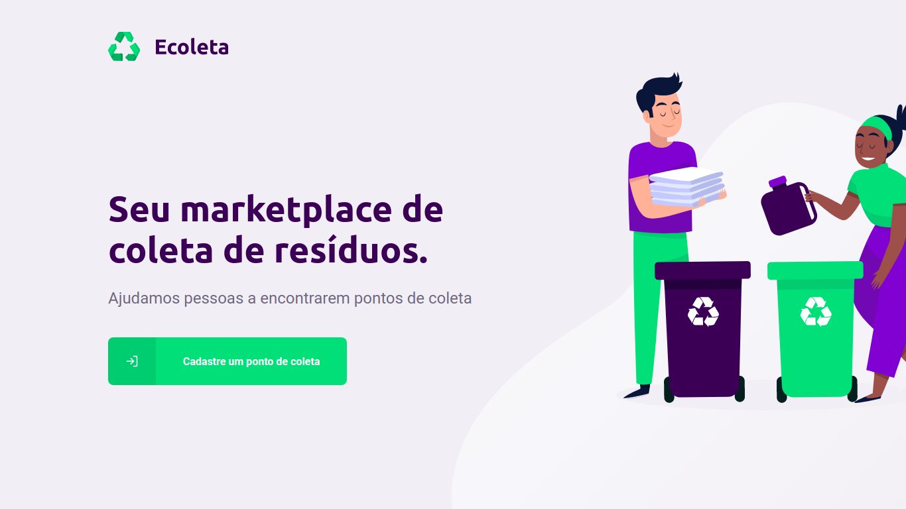
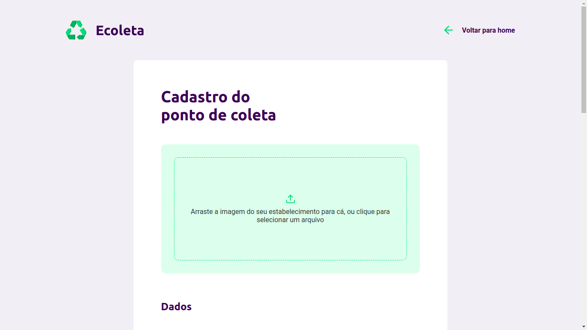
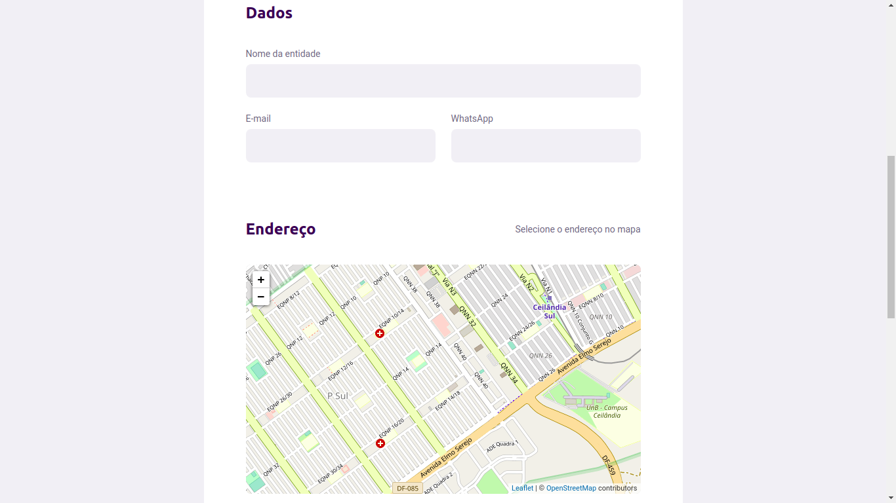
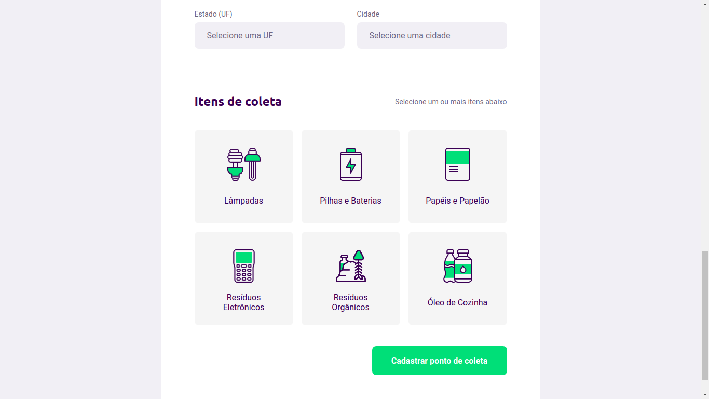

<h1 align="center">
 
  
 
 
Ecoleta
</h1>

Seu marketplace de coleta de resíduos

  

     

  

## :rocket: Tecnologias

### Esse app foi desenvolvido com:

- :memo: **Typescript**
- ⚛️ **React Js**
- ⚛️ **React Native com expo**
- :round_pushpin:	**React-Leaflet**
- 💹 **Node Js com express**
- 📄 **SQLite3**
- ♻️ **Knex**

## Instalação

1.Antes de mais nada, com o IP local do seu computador preencha a variável `BASE_URL` no arquivo `.env`, na raiz do projeto, e a propriedade `baseURL` no arquivo `api.ts`, no diretório `mobile/src/services`.
2. No diretório principal do repositório, instale as dependências utilizando o `yarn`, ou o seu gerenciador de pacotes preferido.

### Back-End (API)

1. No diretório principal do repositório, rode: `cd server`
2. Instale as dependências utilizando o `yarn`, ou o seu gerenciador de pacotes preferido.
3. Rode os comandos `yarn knex:migrate` e `yarn knex:seed`
4. Rode o comando `yarn dev`

### Front-End

1. No diretório principal do repositório, rode: `cd web`
2. Instale as dependências utilizando o `yarn`, ou o seu gerenciador de pacotes preferido.
3. Rode o comando `yarn start` para iniciar a aplicação web

### Mobile

1. No diretório principal do repositório, rode: `cd mobile`
2. Instale as dependências utilizando o `yarn`, ou o seu gerenciador de pacotes preferido.
3. Rode o comando `yarn start` para iniciar o Expo.
4. No seu smartphone, instale o aplicativo `Expo`, da sua loja de aplicativos.
5. No aplicativo, escaneie o QR code gerado no Expo Developer Tools/terminal.

## License

This project is licensed under the MIT License - see the [LICENSE](https://opensource.org/licenses/MIT) page for details.

###### Developed on Next Level Week from [RocketSeat](https://rocketseat.com.br) :rocket: